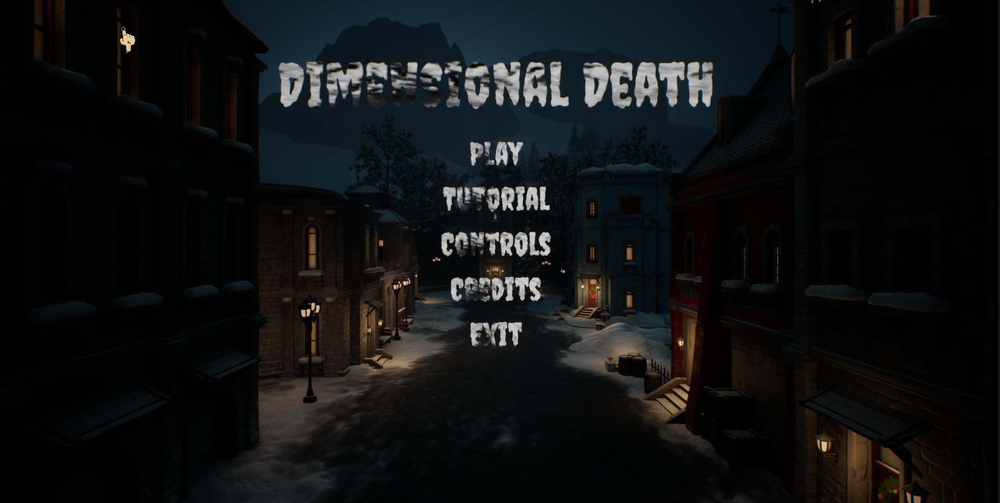
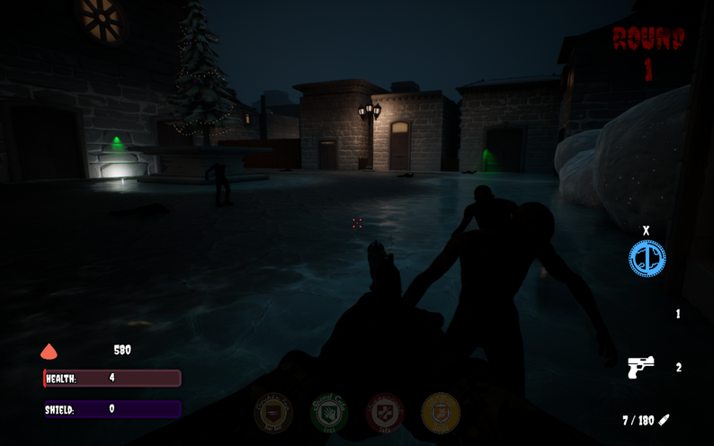
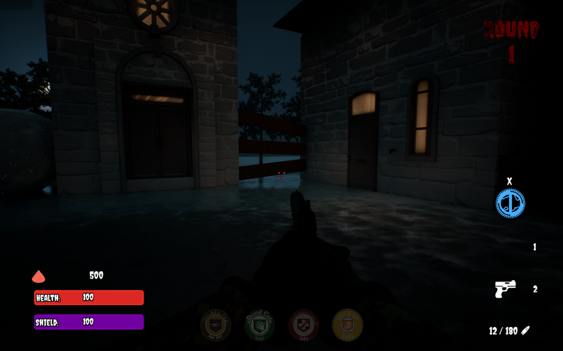
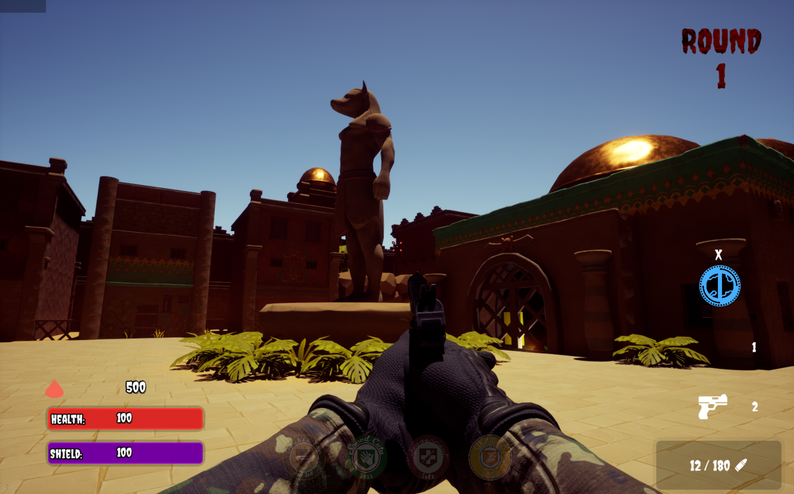
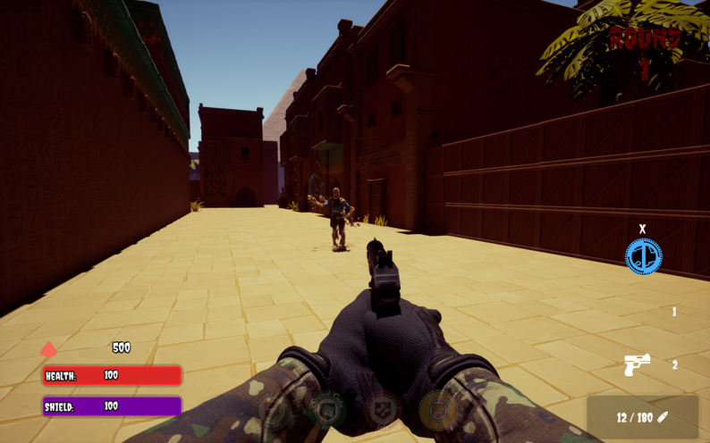
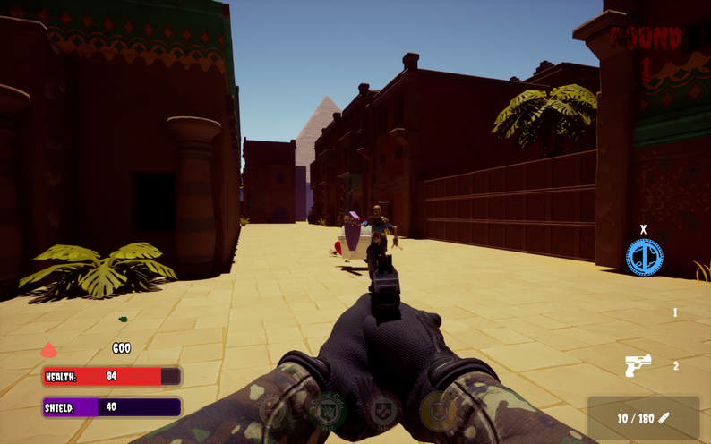

<p align="center">
  
</p>

<h1 align="center">🧟 DIMENSIONAL DEAD 🧟</h1>

<p align="center">
  <b>A First-Person Survival Horror Game with Adaptive AI</b><br>
  <i>What if the monsters remembered?</i>
</p>

<p align="center">
  
  
  
  
</p>

<p align="center">
  <a href="#-download">Download</a> •
  <a href="#-videos">Gameplay</a> •
  <a href="#-lore">Lore</a> •
  <a href="#-features">Features</a> •
  <a href="#-controls">Controls</a>
</p>

---

## 🎮 About The Game

**Dimensional Dead** is a first-person survival horror game where players fight against zombies and skeletons in a world that constantly shifts between darkness and light. But here's the twist — **the enemies learn and adapt to YOUR playstyle using reinforcement learning**.

Built on **Unreal Engine 5.2** with AI trained via reinforcement learning (PPO Algorithm), the game creates a unique experience where enemies evolve based on how you play. Every session feels different. Every death teaches them something new.

> _"In 2047, we went to Mars to find life. We found death instead."_

<p align="center">
  
</p>

---

## 📥 Download

<p align="center">
  <a href="https://drive.google.com/file/d/1xJvE-KW2Mv5Lw6La0WJvkMsgLxwjiH7U/view?usp=sharing">
    
  </a>
  &nbsp;&nbsp;
  <a href="https://drive.google.com/file/d/1CEWDPIV8MDITbU-sXlAK2wEcPyf9E3B4/view?usp=sharing">
    
  </a>
</p>

> **Note:** Download the game build above. The Content & RawContent zip contains additional game assets.

**System Requirements:**
| Component | Minimum |
|-----------|---------|
| OS | Windows 10/11 |
| CPU | Intel i5 or equivalent |
| RAM | 16GB |
| GPU | NVIDIA GTX 1660 or better |
| Storage | 10GB |

---

## 🎬 Videos

<p align="center">
  <a href="https://www.youtube.com/watch?v=qjRLBUr3-No">
    
  </a>
  &nbsp;&nbsp;
  <a href="https://youtu.be/3Tq5QjD8eGc?si=GNvq-KGSW6jh_07H">
    
  </a>
</p>

Watch the **mini trailer** for a quick taste of the horror, or dive into the **full gameplay** demonstration showcasing the adaptive AI in action, the dimensional shift mechanic, and intense survival horror combat!

---

## 📖 Lore

### The Story

**Year 2047.** Humanity reached Mars seeking life. What we found was death itself.

A panicked survivor brought the infection back to Earth, and civilization crumbled within weeks. Now, standing in the ashes of **New Berlin** — where entire armies fell — you are the **sole survivor**.

But these aren't your typical mindless zombies. They remember how you killed their friends. And they're getting smarter.

<p align="center">
  
</p>

📄 **Full Lore Video:** [Watch the complete backstory](https://drive.google.com/file/d/1nZx-pijxS7Zu7gxmRN_WGR16pFKJd-R7/view?usp=sharing)

---

## ✨ Features

### 🧠 Adaptive AI (Reinforcement Learning)

- Enemies **learn your patterns** — attack timing, movement preferences, weapon choices
- AI trained using **PPO Algorithm** and exported via **ONNX** for real-time inference
- Every playthrough is unique because the AI evolves differently based on YOUR actions
- Say goodbye to pattern memorization — these enemies **anticipate** your moves

### 🌗 Dimensional Shift Mechanic

- The world constantly shifts between **darkness and light**
- Master the timing of shifts to gain tactical advantages
- Use dimensional changes to survive and progress through stages

### ⚔️ Intense Combat

- Ranged and melee weapons with durability and ammo management
- Resource scarcity forces strategic decision-making
- Custom collision system for precise hit detection

### 🎨 Stunning Visuals (UE5)

- **Lumen** global illumination for realistic lighting
- **Virtual Shadow Maps** for tension-building atmosphere
- **Niagara** particle effects for blood, fog, and environmental ambiance
- Dark, atmospheric environments designed to terrify

<p align="center">
  
</p>

---

## 🎮 Controls

| Key           | Action                                    |
| ------------- | ----------------------------------------- |
| `W A S D`     | Movement                                  |
| `Mouse`       | Look / Aim                                |
| `Left Click`  | Primary Attack (Shoot)                    |
| `Right Click` | Aim Down Sights                           |
| `Shift`       | Sprint                                    |
| `Space`       | Jump                                      |
| `E`           | Interact                                  |
| `R`           | Reload                                    |
| `Tab`         | Inventory                                 |
| `X`           | **Change Game State (Dimensional Shift)** |
| `Esc`         | Pause Menu                                |

---

## 🔄 Gameplay Loop

```
Spawn → Explore Area → Encounter Enemies → Combat (AI learns)
    → Loot Resources → Dimensional Shift → Move to Next Zone
        → Face Smarter Enemies → Survive or Die → Repeat with Evolved AI
```

<p align="center">
  
</p>

---

## 🛠️ Technical Stack

| Category     | Technology                  |
| ------------ | --------------------------- |
| Game Engine  | Unreal Engine 5.2           |
| Programming  | C++ / Blueprints            |
| AI Training  | ML-Agents (PPO Algorithm)   |
| Model Format | ONNX                        |
| Graphics API | DirectX 12 (Shader Model 6) |
| Physics      | Chaos Physics Engine        |
| VFX          | Niagara System              |
| 3D Assets    | Blender                     |
| Audio        | Audacity                    |

---

## 🚀 What Makes This Different?

| Traditional Horror Games   | Dimensional Dead                    |
| -------------------------- | ----------------------------------- |
| Scripted enemy behaviors   | **AI learns from YOUR gameplay**    |
| Pattern memorization works | **Patterns get countered**          |
| Same experience every time | **Every session is unique**         |
| Predictable scares         | **Unpredictable, evolving threats** |

---

## 🔮 Future Scope

- 🎮 **Multiplayer Co-op** — Shared AI learning from multiple players
- 👹 **More Enemy Types** — Flying enemies, complex boss creatures
- 🗺️ **Procedural Levels** — Randomly generated maps
- 💾 **Persistent AI** — Enemies remember returning players
- 📱 **Platform Expansion** — Console and mobile ports
- 🏆 **Global Leaderboards** — Compete against globally-trained AI

---

## 📸 Screenshots

<p align="center">
  
</p>

---

## 👥 Team Pineapples 🍍

<p align="center">
  <b>TECHNEX 25-26 | GAMEATHON 2K26</b>
</p>

---

## 🏷️ Keywords

`Survival Horror` • `Reinforcement Learning` • `Adaptive AI` • `First Person Shooter` • `Unreal Engine 5` • `ONNX` • `Zombie` • `Procedural Difficulty` • `Horror` • `Action`

---

<p align="center">
  <i>"If you think you are an unbeatable final boss… yeah, this one is for you!!!"</i>
</p>

<p align="center">
  <b>🧟 The dead are learning. Are you ready? 🧟</b>
</p>
